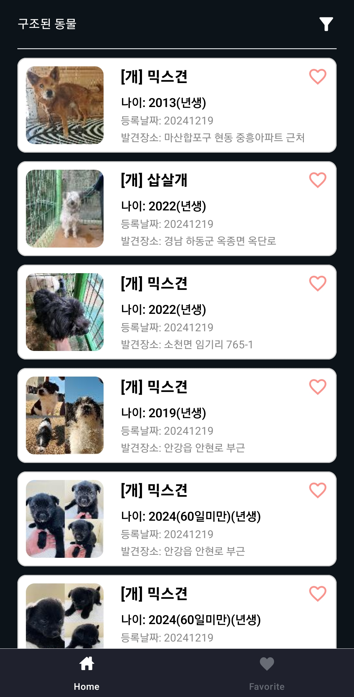
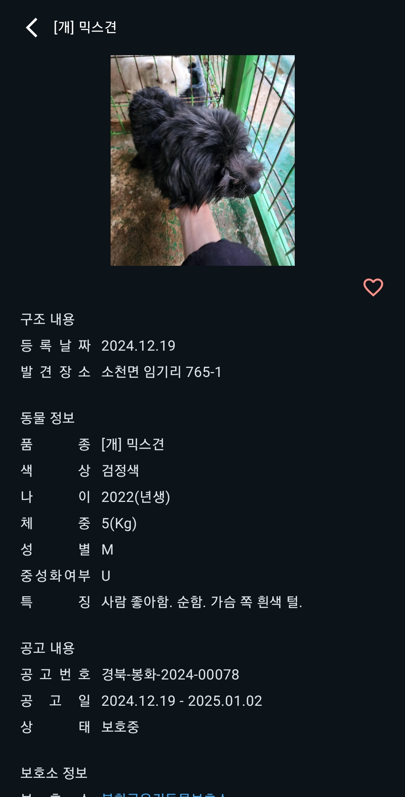
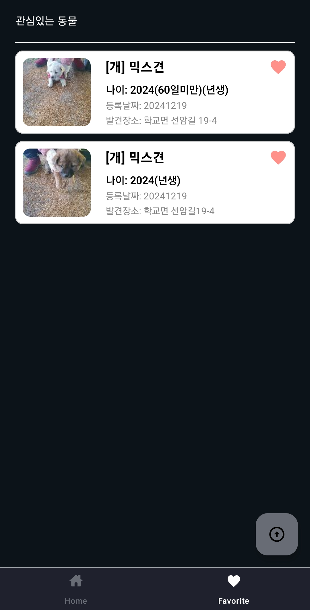
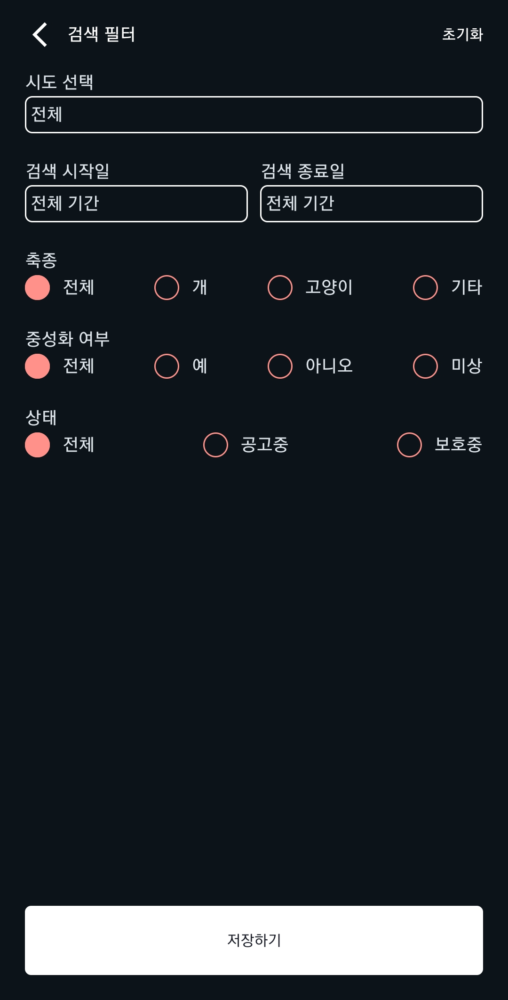

#   RescuedAnimalCompose
공공API를 사용하여 "구조동물 조회" 안드로이드 애플리케이션을 구현하였습니다.

## 📄 프로젝트 목적
반려동물을 키우는 가구가 증가함에 따라 버려지는 동물들이 많아 안타까워 프로젝트를 만들게 되었습니다.  
최신 기술 동향을 파악하고 적용하여 개발 능력을 향상시키기 위해 여러 기술들을 사용하였습니다.

## ⏲️ 개발 기간 
- 2024.10.24(목) ~ 진행중
  
## 💻 개발환경
- **Version** : Java 17
- **IDE** : Android Studio

## ⚙️ 기술 스택
- done
  - **Kotlin**
  - **Jetpack Compose**
  - **Clean Architecture**
  - **MVVM**
  - **MVI**
  - **Repository Pattern**
  - **Hilt**
  - **Retrofit**
  - **Coroutine**
  - **Navigation(Type-Safe)**
  - **Room Database**
    
- doing
  - **Multi Module(build-logic)**

- will do
  - **WorkManager**
  - **Google Analytics**
  - **test code**
  - **UI Test**

## 📝 프로젝트 아키텍쳐
- app
  - Application 패키지
- data
  - 데이터 검색, 저장, 매핑하는 데이터 패키지
- domain
  - 비즈니스 로직으로 독립적인 패키지
  - java/kotlin 으로 구성
- presentation
  - 화면 관련 패키지
- build-logic
  - Gradle 관리 패키지

## 📌 주요 기능
- 구조동물 검색
  - 공공데이터포털에서 제공하는 국가동물보호정보시스템 구조동물 조회 서비스 API를 이용하여 구조동물 리스트 구현
  - 검색 필터를 이용하여 원하는 검색 가능
    - 검색 가능 필터 : 시, 군, 구, 보호소, 검색일자, 축종, 중성화 여부, 상태
  - 데이터 호출 시 로컬 데이터와 비교하여 관심아이콘 변경
- 관심동물 등록
   - 관심있는 동물들을 로컬(Room database)에 저장하여 리스트 구현
   - **구현예정**
     - WorkManager를 통한 로컬 데이터 업데이트
- 마이페이지
  - **구현예정**
    - 로그인
    - 내 반려동물 등록
- 내 반려동물 검색
  - **구현 예정**
    - 반려동물 등록 코드로 검색
  
## 📷 스크린샷
  

  
  
  
  
  

